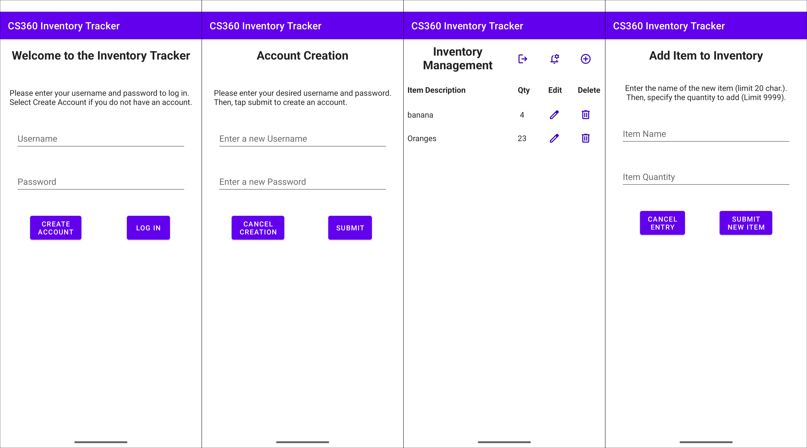
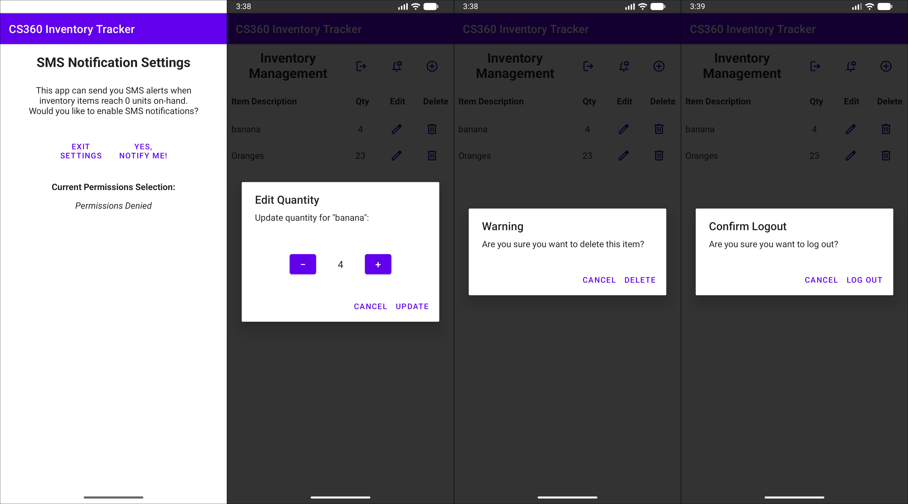
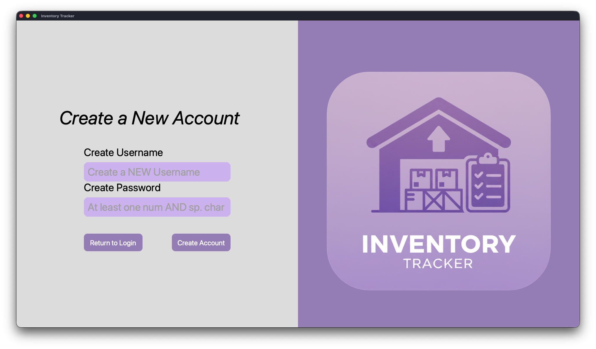
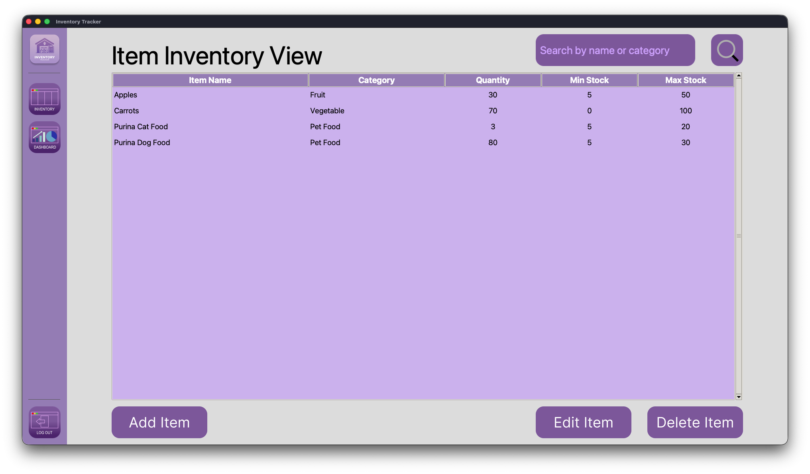
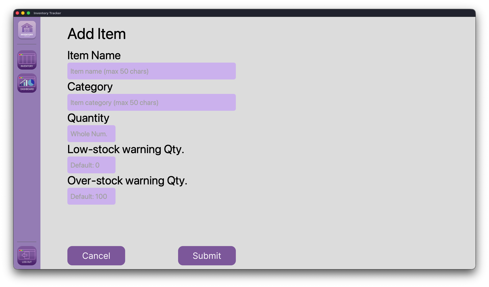
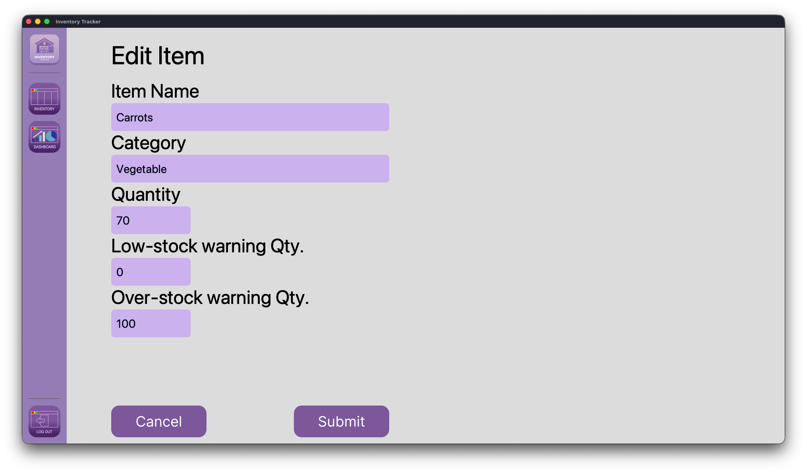
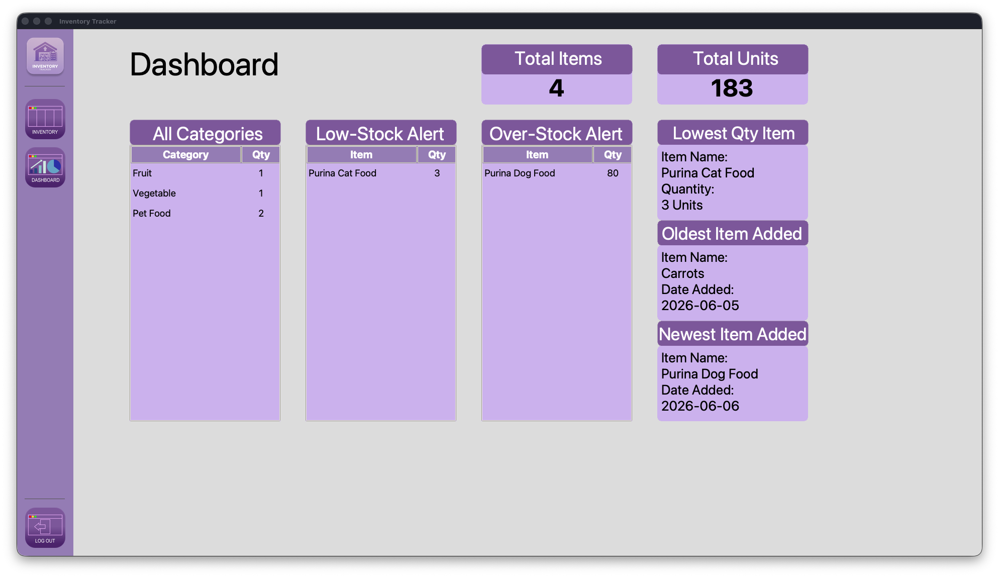



# Enhancement One: Software Design and Engineering

On this page, I will detail the first enhancement that was successfully completed from the original code review of the mobile version of the Inventory Tracker.

## Overview

The first enhancement focused on the overall design and structure of the original application.

Key aspects I aim to address were: 

- Recreate the application in Python from Java
- Create a clear separation of concerns between logic layers, such as GUI layers, database logic, and service logic
- Improve interface design and ensure the final application is cohesive in theme and styling
- Make use of resources such as Tkinter and Figma to accomplish visual components
- Make use of traditional software engineering tools, such as UML diagrams and flowcharts, during the planning stages

## Before and After Comparison
### Original Application GUI

### New Python Application GUI

## Reflection

### What was the original artifact? 

The original artifact is an Android mobile application written in Java that was originally created by closely following the materials for the CS 360 course. The foundation provided by this course allowed me to successfully recreate all backend logic of the application in Python for my proposed enhancement plan.

### Why did I select this artifact to improve and what skills did it show case? 

My new program has been completely rebuilt in Python, leveraging the Java application as the blueprint and foundation to successfully recreate functionality, as well as implement other improvements to flesh out the application into something much more robust than the original project.

I successfully translated my original application from Java to Python using best practices for “Pythonic” writing. I leveraged many sources to accomplish this, from Stack Overflow to GeeksforGeeks, to re-familiarize myself with Python as best I could. I also used other resources to re-familiarize myself with SQLite, which was pivotal to ensure I could make a data-driven application that relied on a locally stored database created by the user.

Compared to the original application, which had tightly coupled logic for all activity screens, the final Python application features a much clearer separation of concerns for all logic layers. For example, all GUI logic now lives in dedicated view files, and logic that supports these visual components now lives exclusively in the service layer files.

The old application had some of the database logic within some of the activity files as well, which should have been exclusively responsible for the logic of elements drawn on the screen, such as button presses. Now, the database logic has been centralized in a dedicated database layer, which is leveraged by the service layer. Finally, the last two layers created, the security layer and model layer, ensure no one file is carrying too heavy a burden for any feature of the application.

Focusing on the design of the project, by leveraging tools such as Figma for visual design and the standard Python interface Tkinter to utilize the Tcl/Tk GUI toolkit, I constructed an application that is aesthetically pleasing and intuitive to use on a desktop. This allowed me to completely rebuild the entire original Java mobile application in Python with a GUI that will work across both macOS and Windows OS.

Although the Tkinter library is considered dated, I needed to ensure I fleshed out my ability to work with a more foundational library before moving on to one that is much more sophisticated and can add things like animations and transitions between screens. The scope of my enhancement did not include animations, but this is an improvement I will consider in future updates to the application.

### Final Reflection

I learned a great deal in desktop application development and feel as though this foundation I have built for myself is the first step in making more applications for macOS or Windows OS, or perhaps even pivoting to focus more on web application development as well. More than anything, I love to create things in any shape or form, and being able to see an application like this come to life as I built each component is incredibly rewarding and satisfying.

Even if it does become increasingly difficult to land a formal 9-to-5 job in this field, I feel as though I can always have a place in this world as a freelancer building things I love to solve problems at a smaller scale for individuals over larger user bases.

[← Back to Home](/)
