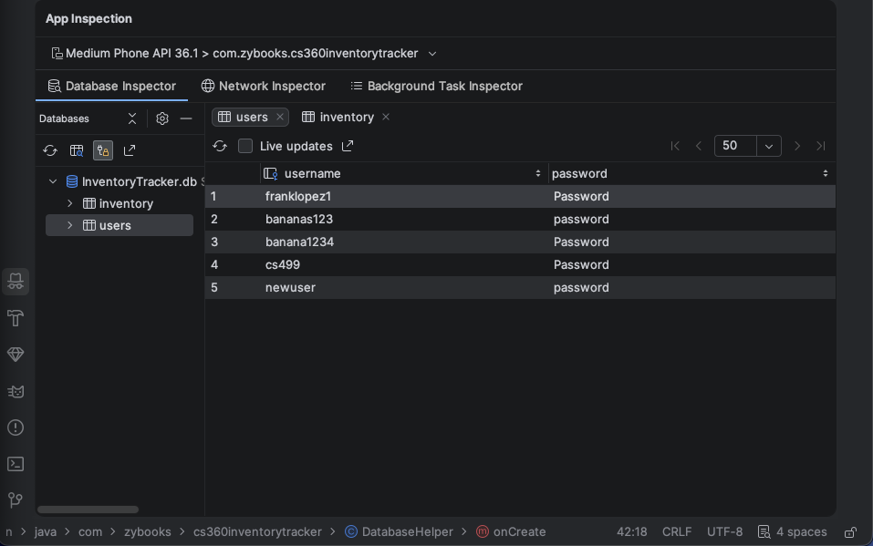
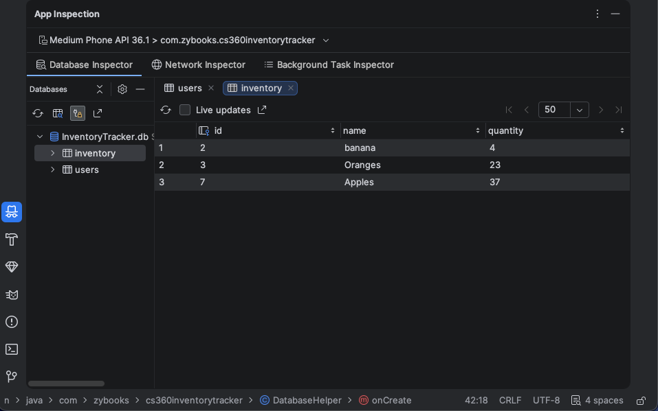



# Enhancement Three: Databases

On this page, I will detail the third enhancement that was successfully completed from the original code review of the mobile version of the Inventory Tracker.

## Overview

The third enhancement focused on making improvements to the use of databases in the original mobile application. SQLite was used for local storage and proof of concept, as in the original mobile application, but the enhanced version now features more robust data validation and security improvements. 

Key aspects I aimed to address were:
- For the User table:
  - Store hashed passwords instead of plaintext.
    - Use the Bcrypt library to support password hashing.
  - Add username uniqueness and validation.
  - Validate login credentials securely.
- For the Inventory table:
  - Add a new category field.
  - Add new timestamp fields for created and modified dates.
  - Add quantity threshold values, including minimums and maximums.
  - Add transaction/update logging.
- Create a new Activity Log table:
  - Add a new table in the database responsible for logging different events.
  - Create events for ADD, EDIT, DELETE, etc.
  - Ensure the records logged are accurate and capture the correct timestamp and item information.
- Lastly, for security enhancements:
  - Ensure parameterized SQL queries are resilient against SQL injection attacks.
  - Add input validation for all input fields.
  - Separate database logic from GUI logic.


## Before and After Comparison
### Mobile Application Database Tables

Old User table, which stored passwords as plain text strings and had no logging-related fields.



Old Inventory table, where all item records consisted only of item name and quantity on hand.



All original database tables exclusively worked with string data types, regardless of the data type being read. This was remedied in the enhanced version.
```java
public class DatabaseHelper extends SQLiteOpenHelper {

    // Variables for database name and version
    private static final String DATABASE_NAME = "InventoryTracker.db";
    private static final int DATABASE_VERSION = 1;

    // Users table
    public static final String TABLE_USERS = "users";
    public static final String COLUMN_USERNAME = "username";
    public static final String COLUMN_PASSWORD = "password";

    // Inventory table
    public static final String TABLE_INVENTORY = "inventory";
    public static final String COLUMN_ITEM_ID = "id";
    public static final String COLUMN_ITEM_NAME = "name";
    public static final String COLUMN_ITEM_QUANTITY = "quantity";
```

### Enhanced Python Desktop App Database Tables

New User table, featuring hashed passwords and created-at timestamp fields.


When passing queries to the database, parameterized queries are leveraged to protect against SQL injection.
```python
# parameterized query using '?' as placeholder to support against
# potential SQL injection point
cursor.execute("""
  INSERT INTO users (username, password_hash, created_at) 
  VALUES (?, ?, ?)""", (username, password_hash, timestamp))
connection.commit()
```

Password hashing and validation are accomplished through the use of Bcrypt. This makes use of randomly generated “salt,” which is appended to any hashed password to further strengthen the password.
```python
# encodes passwords and adds "salt" which is random data
def hash_password(plain_text: str) -> str:
    plain_text_to_bytes = plain_text.encode("utf-8")
    salt = bcrypt.gensalt()
    hashed_plain_text = bcrypt.hashpw(plain_text_to_bytes, salt)
    return hashed_plain_text.decode("utf-8")

# verifies is inputted password and hash password match
def verify_password(plain_text: str, hashed_plain_text: str) -> bool:
    plain_text_to_bytes = plain_text.encode("utf-8")
    hashed_plain_text_to_bytes = hashed_plain_text.encode("utf-8")
    return bcrypt.checkpw(plain_text_to_bytes, hashed_plain_text_to_bytes)
```

New Inventory table, featuring newly added category, min/max threshold, and created/modified fields.


New Inventory Transactions table, completely new to the Python version of the application. 
It now features a running history of all item changes, such as ADD, UPDATE, and DELETE events. It is complete with fields such as old quantity, new quantity, and timestamp.


## Reflection

### What was the original artifact? 

The original artifact is an Android mobile application written in Java that was originally created by closely following the materials for the CS 360 course. The foundation provided by this course allowed me to successfully recreate the entire application in Python for my proposed enhancement plan.

### Why did I select this artifact to improve and what skills did it show case? 

The inclusion of this particular enhancement was mostly due to my own personal affinity for activity tracking data. I have worked with data for the last five years at my current workplace, and one thing I have leveraged more than any other skill is my ability to find correlations across data sets. I initially only wanted to include the new Inventory Transaction table. However, when I first set out to make the addition, I realized the other tables were also lacking fields that would support the creation of this table.

Upon reviewing the User table of the original application, I realized that I had no password hashing methods, nor did I have any way to ensure passwords were more sophisticated than just a certain character length. I leveraged Bcrypt for my password hashing, but I also built new logic to check if the entered password contained at least one numerical character and at least one special character, such as <>?,./.

Then, once I reviewed the Inventory table, I realized that I had no way to determine when inventory items were last modified. I also had no way to make the new dashboard view possible because I lacked fields such as category, minimum threshold, and maximum threshold. These fields helped evolve the original out-of-stock notification functionality. Once included, the database fully supported my aspirations for the algorithmic enhancements made for the application as well.

I also included robust error handling throughout any input fields related to functions that altered records in the database, allowing the application to give meaningful feedback to the user if anything was entered incorrectly. From character lengths to input type, all cases were covered for any field where a user would need to input data. This was done not only to make the experience enjoyable for the user, but also to further fortify the application against malicious intent.

### Final Reflection

I have successfully completed all features I set out to finish at the beginning of the course. I reimagined the overall structure of the application with a clear separation of concerns for all original activities from the Java mobile application. Previously tightly coupled logic for both UI and functionality is now contained in dedicated classes that work together seamlessly. This is especially true for the database of the application and how it works with SQLite. The application is now well fortified against potential malicious actions that are normally exploited through input fields and interactable objects.

I learned a great deal more about SQLite best practices and parameterized queries. I also learned how to ensure all database-related functionality was clearly localized in dedicated classes and functions that handled very specific responsibilities. For example, the db_manager.py file is solely responsible for ensuring the database exists or is created upon launch of the application, whereas the dedicated repository files communicate with the database’s individual tables.

All functionality defined in the repository files is then called upon by the dedicated service files, which contain all input validation logic and edge cases before any data is passed. Finally, the view files for the UI, where actual entry boxes and interactable objects are defined, make use of the service functionality when passing user inputs or actions.

This decoupling ensures the application has many fallbacks when processing data or inputs and can fail gracefully rather than crashing altogether while running. In the original Java application, a single typo in any file could cause a catastrophic failure in the application, and it would cease to run. The newly enhanced application is much more resilient to these shortcomings when working with the database in any view, input field, or interactable table in the application.

[← Back to Home](/)
