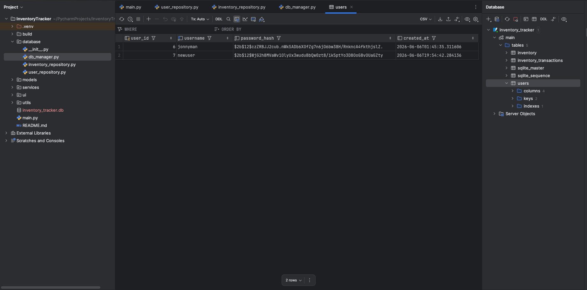
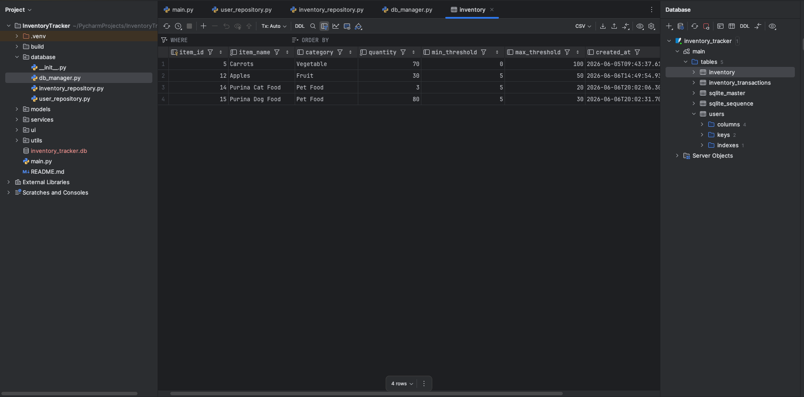
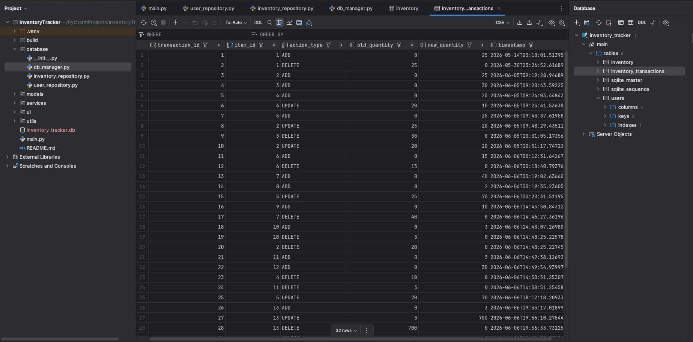



# Enhancement Three: Databases

On this page, I will detail the third enhancement that was successfully completed from the original code review of the mobile version of the Inventory Tracker.

## Overview

The third enhancement was focused in making imporvements in the use of databases in the original mobile application. SQLite was used for local storage and proof of concept like the original mobile application, but now features robust data validation and security improvements. 

Key aspects I aim to address were: 
- For the User Table: 
  - Store hashed passwords instead of plaintext
    - Use Bcrypt library to support password hashing
  - Add username uniqueness and validation
  - Validate log in credentials securely
- For the Inventory Table: 
  - Add a new category field
  - Add a new timestamp field (created/modified)
  - Add quantity threshold values (minimums and maximums)
  - Add transaction/update logging
- Create New Activity Log Table
  - New table featured in database responsible for logging different events
  - Create events for ADD, EDIT, DELETE etc...
  - Ensure the records logged are accurate and capture the correct timestamp and item information
- Lastly, for Security Enhancements:
  - Ensure parameterized SQL queries are resilient against SQL injection attacks
  - Input validation for any input fields
  - Separate database logic from GUI logic


## Before and After Comparison
### Mobile Application Database Tables
Pending original view, capture in android studio database viewer

Old User table, stores passwords as plain text strings, no logging related fields. 

Old Inventory Table, all item records only consist of item name, and quantity on hand. 

All original database tables exclusively worked with string data types regardless of data type being read. This was remedied in the enhanced version. 
```java
public class DatabaseHelper extends SQLiteOpenHelper {

    // Variables for database name and version
    private static final String DATABASE_NAME = "InventoryTracker.db";
    private static final int DATABASE_VERSION = 1;

    // Users table
    public static final String TABLE_USERS = "users";
    public static final String COLUMN_USERNAME = "username";
    public static final String COLUMN_PASSWORD = "password";

    // Inventory table
    public static final String TABLE_INVENTORY = "inventory";
    public static final String COLUMN_ITEM_ID = "id";
    public static final String COLUMN_ITEM_NAME = "name";
    public static final String COLUMN_ITEM_QUANTITY = "quantity";
```

### Enhanced Python Desktop App Database Tables

New User Table, featuring hashed passwords, and created at time stamp fields. 


When passing queries to database, parameterized queries are leveraged to support against SQL injection. 
```python
# parameterized query using '?' as placeholder to support against
# potential SQL injection point
cursor.execute("""
  INSERT INTO users (username, password_hash, created_at) 
  VALUES (?, ?, ?)""", (username, password_hash, timestamp))
connection.commit()
```

Password hashing and validation accomplished through use of Bcrypt. Makes use of randomly generated "salt" which is appended to any encrypted password to further strengthen password. 
```python
# encodes passwords and adds "salt" which is random data
def hash_password(plain_text: str) -> str:
    plain_text_to_bytes = plain_text.encode("utf-8")
    salt = bcrypt.gensalt()
    hashed_plain_text = bcrypt.hashpw(plain_text_to_bytes, salt)
    return hashed_plain_text.decode("utf-8")

# verifies is inputted password and hash password match
def verify_password(plain_text: str, hashed_plain_text: str) -> bool:
    plain_text_to_bytes = plain_text.encode("utf-8")
    hashed_plain_text_to_bytes = hashed_plain_text.encode("utf-8")
    return bcrypt.checkpw(plain_text_to_bytes, hashed_plain_text_to_bytes)
```

New Inventory Table, featuring newly added category, min/max threshold, and created/modified fields. 


New Inventory Transactions table, completely new to the Python version of the application. 
Now features running history of all item changes such as ADD, UPDATE, and DELETE events. 
Compelte with fields such as old quantity, new quantity, tinestamp. 


## Reflection

### What was the original artifact? 

The original artifact is an Android mobile application, written in Java that was original created by closely following for materials for course CS 360. The foundation provided by this course allowed me to successfully recreate the entire application in Python for my proposed enhancement plan of the application.

### Why did I select this artifact to improve and what skills did it show case? 

The inclusion of this particular enhancement was mostly due to my own personal affinity for activity tracking data. I have worked with data for the last five years at my current workplace, and one thing that I have leveraged more so than any other skill is my ablility to find correlations across data sets. I initially only wanted to include the new Inventory Transaction table and when I first set out to make the addition, I realized the other tables were also lacking in fields that would support the creation of this table. 

Upon reviewing the User Table of the original application, I realized that I had no encryption methods for passwords, nor did I have any sort of means to ensure passwords were any more sophisticated than just a certain character length. I leverged Bcrypt for my data encryption, but also built new logic to check if the entered password contained at least 1 numerical character and at least 1 special character ex: <>?,./ etc... 

Then once I reviewed the inventory table, I realized that I had no means to determine when inventory items we last modified. I also had no means to make the new dashboard view possible as I lacked fields such as a category field or minimum and maximum thresholds to evolve to original out of stock notification functionality. Once included, the database fully supported my aspirations for the algorithmic enhancements made for the application as well. 

I also included robust error handling throughout any input fields related to any functions that altered records in the database, allow the application to give meaningful feedback to the user in case anything was entered incorrectly. From character lengths, to input type, all cases were covered for any field a user would need to input data. This was done not only to make the experience enjoyable for the user, but to further fortify the applciation against malicious intent. 

### Final Reflection

I have successfully completed all features I set out to finish at the beginning of the course. I reimagined the overall structure of the application with a clear separation of concerns for all original activities from the java mobile application. Previously tightly coupled logic for both UI and functionality is now contained in dedicated classes that work together seamlessly. This is especially true for the database of the application and how it works with SQLite. The application is now incredibly well fortified against potential malicious actions normally exploited through input fields and interactable objects. 

I learned a great more about SQLite best practices and parameterized queries. I also learned how to ensure all database related functionality was clearly localized in dedicated classes and functions that handled very specific functions. For example, the db_manager.py file is solely responsible for ensuring the database exists or is created upon launch of the application, whereas the dedicated repository files communicate with the database’s individual tables. All functionalities defined in the repository files are then called upon by the dedicated service files with contain all input validation logic and edge cases before any data is passed. Finally, the view files for the UI where actual entry boxes and interactable objects are define make use of the service functionalities when passing user inputs or actions. 

This decoupling ensures the application has many fallbacks when processing data or inputs and can fail gracefully rather than crashing altogether when running. In the original java application, a single typo in any file would cause a catastrophic failure in the application and it would cease to run. The newly enhanced application is much more resilient to these short coming when working with the database in any view, input field, or interactable table in the application. 

[← Back to Home](/)
