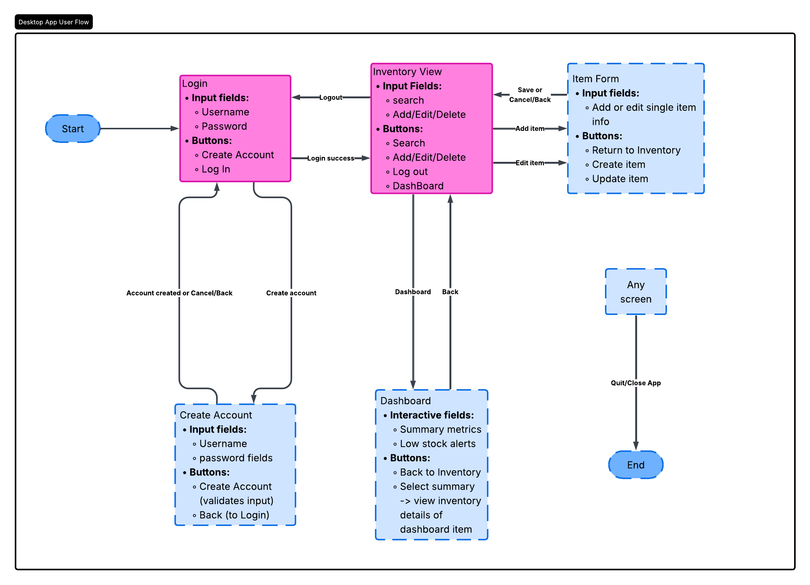
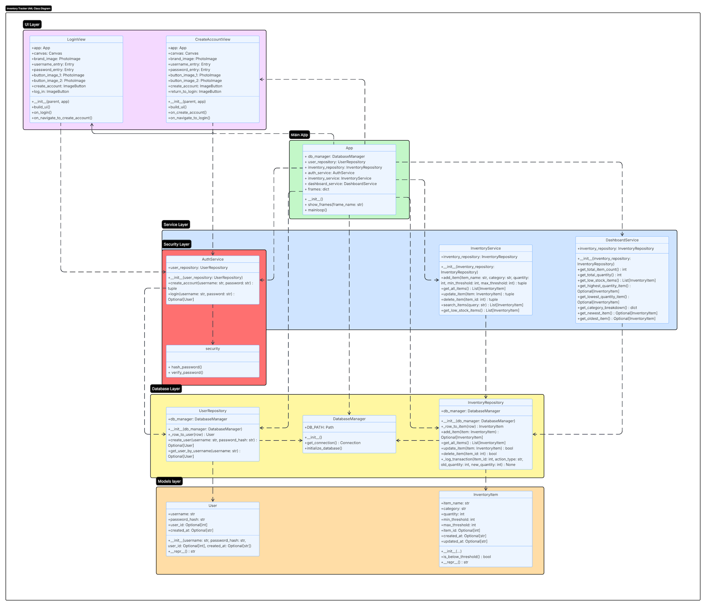

# Professional Self-Assessment

Pending self review

## Code Review of Original Artifact

The following code review provides an overview of an application I previous created as part of the SNHU CS program for a course titled CS 360: Mobile Architecture and Programming.

This application had a few short comings that I will be addressing within this review as primary candidates to enhance and improve upon to create a new application that is much more in line with software development best practices. 



## Portfolio Enhancements

### Planned Application Flow

The following diagram depicts the expected user flow the new enchanced application will accomplish.

### UML Diagram

The following diagram depicts the planned software structure of the final application. The only items missing are additional views which would go in the UI layer for the Inventory, Dashboard and Add/Edit Item Form views. These will be added over time as I have plans to further improve the application. 

### Enhanced Application Demonstration

The following video walks through all functionality of the completed application. 



### Software Design and Engineering

Pending narritive information

### Algorithms and Data Structures

Pending narritive information

### Databases

Pending narritive information
